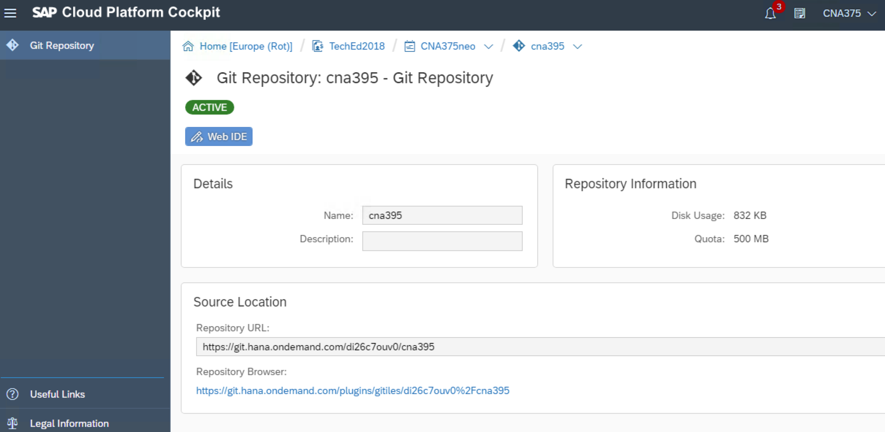
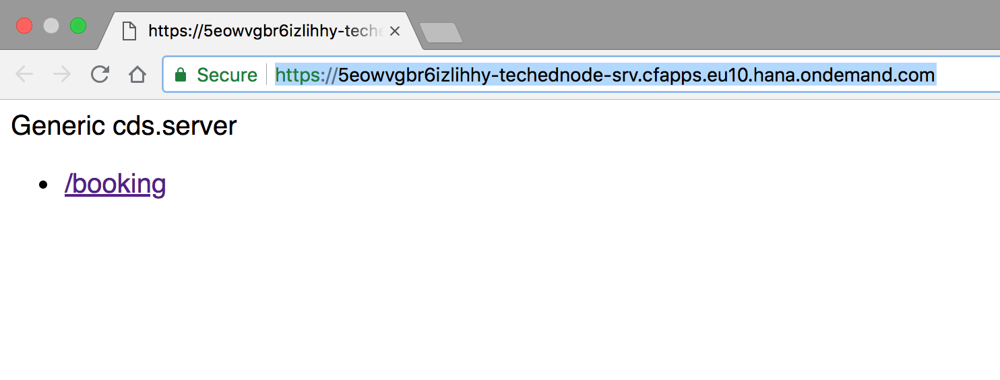
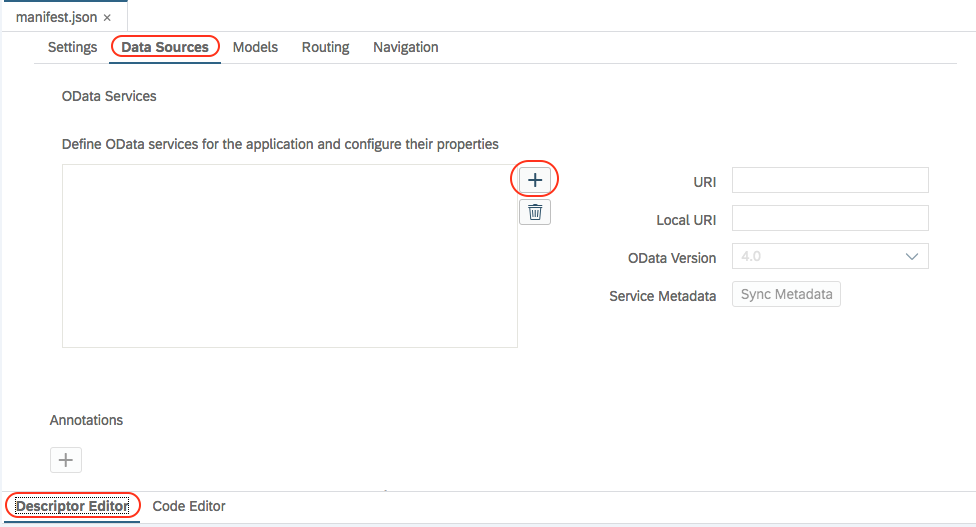

# Exercise 04: Build a User Interface using SAP UI5 for booking space tickets

## Estimated time

30 minutes

## Objective

In this exercise, we will build a User Interface based on SAP UI5 so that users can create a booking from the UI of our app.

This exercise is structured into two parts: <br /><br />
**A.) Import, build and deploy the project into SAP Web IDE <br />
B.) Build the User Interface using SAP Web IDE <br />**

In this exercise, we will import the source code from Git service into SAP Web IDE. In SAP Web IDE, the database artifacts are deployed to SAP DBaaS service(SAP HANA) running on SAP Cloud Platform Cloud Foundry environment.

## Exercise description: 

## Part A: Import, build and deploy the project into SAP Web IDE

1. Launch the [SAP Cloud Platform Cockpit's git service](https://account.hana.ondemand.com/cockpit#/globalaccount/8fd39023-a237-4d71-9b6a-ed9d1719d275/neosubaccount/06b416a3-9282-4cb7-ae72-e23031b005ca/git). If you completed part B of exercise 3, choose your repository if not provide your credentials (email and password) to first login and then choose `cloud-sample-spaceflight-node` and click on it. Click on the `Web IDE` button as shown to launch SAP WebIDE.



2. You will be prompted to login, enter your credentials and click Log on.


3. Once the SAP Web IDE loads, choose `File` -> `Git` -> `Clone Repository`. 


If SAP Web IDE prompts to clone the repository directly, just click on `Clone`.

 

4. You will be asked to enter the credentials once again. Enter the credentials (email and password) provided by the CNA375 session owners. The authentication in step 2 is for the SAP WebIDE access, and here in this step it is to verify access to the git repository that contains the code. There could be several members cloning and working on a common project repository and this ensures only members within the sub-account are able to clone the repository.

 

5. Now you will be able to see the code that was cloned into your SAP Web IDE workspace.


6. Right click on your project and click on project settings. 


7. Choose the Cloud foundry tab and from the list of dropdown options choose the url, "https://api.cf.eu10.hana.ondemand.com".


8. You will be prompted to login. Enter your Cloud Foundry log on credentials: email and password and then your organization and space will be automatically be populated as shown.


9. Open package.json file from the root folder,`cloud-sample-spaceflight-node/package.json`, and remove the highlighted lines. These are lines specific to SQLite database that was used locally. Now as we will deploy the database artifacts into SAP HANA, these lines must be removed.
```
"sqlite3": "^4.0.2"                                 // remove line from dependencies
"driver": "sqlite",                                 // remove line from model
"url": "cloud-samples-spaceflight-node.db"          // remove line from model
```
10. Now right click on the db folder of the project and click on Build as shown:


11. The log output can be seen in the console as below. 


12. In order to view the created database tables, we enable SAP HANA Database Explorer on SAP Web IDE. To do this goto `Tools` menu on the top -> choose `Preferences` -> click `Features` in the left tabs -> enter `hana` in the search field -> Switch ON the `SAP HANA Database Explorer` as shown:


13. The screen will prompt to Refresh. Click `Refresh`. 


14. After the reload we will have the aditional database explorer tab on the left. Click on this tab and the Database Explorer Connectivity window can be seen as below:


15. Click Connect button in the above image and add a HDI database container. Choose the + button shown below:


16. Choose the HDI Container with the name of your project under the organization `TechEd2018_CNA375-TechEd` and click `OK`.
 


17. Now the database can be seen with the tables as shown:


18. Click on Open Data button to see the content provided from the CSV files into the tables:


19. Open `mta.yml` file from the root folder and change the service-plan of `<project_name>-uaa` from `default` to `application`.
```
  - name: <project_name>-uaa
    type: com.sap.xs.uaa
    parameters:
      service-plan: application
``` 

20. Right click the srv folder and choose `Build` and then choose `Build CDS`. 


The log output can be seen in the console as below. 


Include the following lines to the `srv/package.json` file. Note that this package.json file resides in the `srv` folder. 
```
  "cds": {
    "data": {
          "driver": "hana",
          "hana": {
                "tag": "hana"
          }
      }
  }  
```

21. Right click the srv folder and choose `Run` and then choose `Run as Node.js Application`. This takes a couple of seconds as it deploys the service to cloud foundry.


The running Node.js application can be seen here. 


On clicking the URL we can see the service information.



Click on the /booking service to access the XML metadata information of the oData service exposed. In addition the URL now is changed to http://<service_URL>/booking/$metadata


Change the $metadata part of the URL to something meaningful from our exposed service such as Planets to see the JSON response: 


22. Goto [SAP Cloud Platform destinations](https://account.hana.ondemand.com/cockpit#/globalaccount/8fd39023-a237-4d71-9b6a-ed9d1719d275/neosubaccount/06b416a3-9282-4cb7-ae72-e23031b005ca/destinations) to create a destination.

We just imported and built our data model and node service in part A of this exercise.

## Part B: Build the User Interface using SAP Web IDE

1. Right click our project and choose `new` and then `HTML5 module`.


2. Choose the SAPUI5 Application template


3. Enter Module Name as `ui` and Namespace as `space.itineraries.company`.


4. Give the View Name as App and click on Finish


5. The UI module code is generated. Expand the `ui` folder and then `webapp` folder. Within view and controller folders you can see two generated files: App.view.xml and App.controller.js


6. Open the `manifest.json` file present in the webapp folder under ui. Click on `Descriptor Editor` below and then choose the `DataSources` sub-tab above. Click the + button to add a data-source as shown.

 

7. Choose `Service URL` from the tabs on the left. In the dropdown menu, pick the destination that appears in the dropdown menu. Under relative path enter `/` and click on `Test`. The service is now selected and click on `Next`.

 

8. Leave the selection as `Use default model` and click Next.

 

9. Click Finish. Save the manifest.json file. 

 

10. Under view folder, replace the code in `App.view.xml` with the below code:
```
<mvc:View controllerName="space.itineraries.company.ui.controller.App" xmlns:html="http://www.w3.org/1999/xhtml" xmlns:mvc="sap.ui.core.mvc" displayBlock="true" xmlns="sap.m">
	<Carousel>
		<mvc:XMLView viewName="space.itineraries.company.ui.view.ListBookings"/>
		<mvc:XMLView viewName="space.itineraries.company.ui.view.CreateBooking"/>
	</Carousel>
</mvc:View>
```
This declares two XML Views: `ListBookings` and `CreateBooking`. We will create them in the next steps.

11. Right click on the `view` folder and choose `new` -> `SAPUI5 view`.


12. Give the name as `CreateBooking`, click on `Next` and then `Finish`. Repeat step 11 to create another SAPUI5 view and this time give the name of the view as `ListBookings`. 


13. Note that 2 additional files for CreateBooking and ListBookings are added under view and controller folders for each respectively.


14. Right click on the `ListBookings.view.xml` file and choose `Open Layout Editor`


This will open the modeling pane for the view as shown:


15. On the right side panel, click on the `entity set` button and choose the OData service that was added in steps 6 to 9.


Select the option __Define entity set and set the selected control as template.__.
For the field __Entity Set__ select the value `/Bookings` from the drop-down.
And for __Expand Associations__ select `Itinerary`.
Click the OK button to save the configuration.


Provide a Title such as `Space Itineraries Company` for the page title.


16. In the `Search for control` field enter the value __list__ and drag and drop the `List` control on the view.


17. Select the list item on the view, by clicking on the `List Item 1` object and verify that it is selected by checking the control chain:


Adapt the property `Title` by clicking on the `Bind this property` button on the right side of the property.


A window with all the data fields and a text area appear to customize the title. Compose a value such as: `{CustomerName} travels from {Itinerary/Name}`. Double click the data fields to use them as a part of the text.


Repeat the same process for the property `Description`. Enter the value `Booking number {BookingNo} on {DateOfTravel}`.


And lastly, change the `type` of the list item from the properties pane to `Inactive`.


> As a workaround to a known issue that will be fixed we need to change a line in the current view. Please right click the `ListBookings.view.xml` and choose `Open Code Editor` option. Now replace line number 4 with the following: `<Page title="Title" content="{path:'/Bookings',parameters:{$expand:'Itinerary($select=Name)'}}">`

18. Let us move on to the second view `CreateBooking`. Open the `CreateBooking.view.xml` file by double-clicking on it in the file structure. Replace the content with the code snippet below:
```
<mvc:View controllerName="space.itineraries.company.ui.controller.CreateBooking" xmlns="sap.m" xmlns:core="sap.ui.core"
	xmlns:mvc="sap.ui.core.mvc">
	<App>
		<pages>
			<Page title="{i18n>AppTitle}">
				<Panel headerText="{i18n>createBookingPanelTitle}" class="sapUiResponsiveMargin" width="auto">
					<VBox class="sapUiSmallMargin">
						<Label text="Name:" labelFor="customerNameInput"/>
						<Input id="customerNameInput"
							value="{ path:'newBooking>/CustomerName', type:'sap.ui.model.type.String', constraints : { minLength : 1 } }"
							valueLiveUpdate="true" required="true" width="60%" class="sapUiSmallMarginBottom"/>
						<Label text="Email:" labelFor="emailInput"/>
						<Input id="emailInput"
							value="{ path:'newBooking>/EmailAddress', type:'sap.ui.model.type.String', constraints : { search : '\\S+@\\S+\\.\\S+' } }"
							valueLiveUpdate="true" required="true" width="60%" class="sapUiSmallMarginBottom"/>
						<Label text="Choose a journey:" labelFor="selectedItineraryId"/>
						<Select id="selectedItineraryId" width="60%" class="sapUiSmallMarginBottom" items="{ path: '/Itineraries', sorter: { path: 'Name'} }">
							<core:Item key="{ID}" text="{Name}"/>
						</Select>
						<Label text="Date of travel:" labelFor="dateOfTravel"/>
						<DatePicker id="dateOfTravel"
							value="{ path:'newBooking>/DateOfTravel', type:'sap.ui.model.type.Date', formatOptions: { style: 'medium', stringParsing: true } }"
							required="true" class="sapUiSmallMarginBottom" width="60%"/>
						<Label text="Number of passangers:" labelFor="numPassengers"/>
						<Input id="numPassengers"
							value="{ path:'newBooking>/NumberOfPassengers', type:'sap.ui.model.type.Integer', constraints : { minimum : 1 } }"
							valueLiveUpdate="true" required="true" width="60%" class="sapUiSmallMarginBottom"/>
						<Label text="Credit card number:" labelFor="creditCard"/>
						<Input id="creditCard"
							value="{ path:'newBooking>/PaymentInfo_CardNumber', type:'sap.ui.model.type.String', constraints : { maxLength: 16 } }"
							valueLiveUpdate="true" required="true" width="60%" class="sapUiSmallMarginBottom"/>
						<Button text="{i18n>bookButtonText}" press="onBook" class="sapUiSmallMarginEnd"/>
					</VBox>
				</Panel>
			</Page>
		</pages>
	</App>
</mvc:View>
```

19. Open the `CreateBooking.controller.js` file under controller folder and replacing the content with the following code snippet:
```
sap.ui.define([
	"sap/ui/core/mvc/Controller",
	"sap/ui/model/json/JSONModel",
	"sap/m/MessageToast"
], function (Controller, JSONModel, MessageToast) {
	"use strict";
	return Controller.extend("space.itineraries.company.ui.controller.CreateBooking", {
		onInit: function () {
			var newBookingModel = new JSONModel({
				BookingNo: "",
				CustomerName: "",
				EmailAddress: "",
				DateOfTravel: "",
				Cost: null,
				NumberOfPassengers: null,
				Itinerary_ID: null,
				PaymentInfo_CardNumber: null
			});
			this.getView().setModel(newBookingModel, "newBooking");
		},

		onBook: function () {
			var oModel = this.getView().getModel(),
				newBookingModel = this.getView().getModel("newBooking"),
				oBinding = oModel.bindList("/Bookings");

			// get the id of the selected itinerary
			newBookingModel.setProperty("/Itinerary_ID", this.byId("selectedItineraryId").getSelectedKey());

			// assign random cost between 3000 and 1000 space money
			newBookingModel.setProperty("/Cost", Math.floor((Math.random() * (3000 - 1000) + 1000)).toString());

			// assign random string with lenght 16 for the BookingNo
			newBookingModel.setProperty("/BookingNo",
				(Math.random().toString(36).substring(2, 10) + Math.random().toString(36).substring(2, 10))
				.toUpperCase());

			var oContext = oBinding.create(JSON.parse(newBookingModel.getJSON()));
			oContext.created().then(function () {
				MessageToast.show("created");
			});

			// clear up the form
			Object.keys(JSON.parse(newBookingModel.getJSON())).forEach(prop => newBookingModel.setProperty(`/${prop}`, null));
		}
	});
});
```
20. Under i18n folder, replace the content in `i18n.properties` file with the following values:
```
createBookingPanelTitle=Create a booking
bookButtonText=Book
AppTitle=Space Itineraries Company
``` 

21. Now right click the `ui` folder and `Run as a Web Application`. 

 

22. Now bookings can be created on this page and on traversing to the next page, the bookings can be viewed.


Congratulations. We just built a UI for our Space travel bookings app. In the next exercise we will build and deploy the full-stack application to SAP Cloud Platform.

Click [here](../exercise05/README.md) to continue with Exercise 5.
